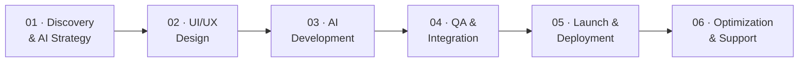

<!--START_SECTION:waka-->

  
  
  
  

  

 

### 💼 About Markeltree

**Markeltree LLC** is a Miami-based software company engineering intelligent
digital products — AI SaaS platforms, MVPs, chatbots, voice agents and
automation systems — for startups and growing businesses worldwide.

> 🎯 **Mission** — Empower businesses through innovation, automation
> and human-centered technology.

📍 400 NW 26th St, Miami, FL 33127, USA
📞 [+1 (305) 323-8395](tel:+13053238395)  ·  ✉️ [info@markeltree.com](mailto:info@markeltree.com)

 

## 📈 Numbers Behind Our Success

| 🚀 | 🌍 | ⭐ | 🗓 |
|:--:|:--:|:--:|:--:|
| **400+** | **180+** | **95%** | **2** |
| Projects Delivered | Global Clients | Client Satisfaction | Years of Expertise |

## 🔧 What We Do

<table>
<tr>
<td width="50%" valign="top">

### 🤖 Artificial Intelligence

- [AI SaaS Platform Development](https://markeltree.com/ai-saas-platform-development/)
- [AI MVP Development](https://markeltree.com/ai-mvp-development/)
- [AI Chatbot Development](https://markeltree.com/ai-chatbot-development/)
- [AI Voice Agent Development](https://markeltree.com/ai-voice-agent-development/)
- [Generative AI Development](https://markeltree.com/generative-ai-development/)
- [AI Integration Services](https://markeltree.com/ai-integration-services/)
- [AI Workflow Automation](https://markeltree.com/ai-workflow-automation/)
- [Machine Learning Development](https://markeltree.com/machine-learning-development/)
- [Cognitive Automation](https://markeltree.com/cognitive-automation/)
- [Predictive Analytics](https://markeltree.com/predictive-analytics/)

</td>
<td width="50%" valign="top">

### ⚙️ Engineering

- [Custom Software Development](https://markeltree.com/software-development/)
- [Web Development](https://markeltree.com/web-development/)
- [Mobile App Development](https://markeltree.com/mobile-app-development/)
- [MVP Design & Development](https://markeltree.com/mvp-development-company/)
- [Blockchain & Web3 Development](https://markeltree.com/blockchain-development/)
- [Game Development](https://markeltree.com/game-development/)

### 💡 Why Markeltree

- **Founder-led delivery** — you talk to decision-makers
- **API-first, cloud-native** architecture built to scale
- **Transparent sprints** with real milestones

</td>
</tr>
</table>

## 🛠 Tech Stack

**AI & Machine Learning**

**Frontend**

**Backend & Data**

**Cloud & DevOps**

**Blockchain & Mobile**

## 🚀 How We Build

<b>See what happens at each stage →</b>

 

| | Stage | What Happens |
|:--:|---|---|
| 01 | **Discovery & AI Strategy** | Business goals, user needs and AI opportunities mapped into a clear product brief and delivery plan. |
| 02 | **UI/UX Design** | Interfaces that make complex AI workflows feel simple — dashboards, chatbot flows, voice interactions. |
| 03 | **AI Development** | API-first, scalable builds on Next.js, Node.js, Python, OpenAI and cloud infrastructure. |
| 04 | **QA & Integration Testing** | Functional, performance and edge-case testing across every AI feature and integration. |
| 05 | **Launch & Deployment** | Zero-downtime rollout, environment config, monitoring and a structured go-live checklist. |
| 06 | **Optimization & Support** | Post-launch performance tracking, model monitoring and iteration on real user data. |

## 🧩 Success Stories

<table>
<tr>
<td width="33%" valign="top">

#### 🔷 [NexaFlow](https://markeltree.com/case-studies/nexaflow-ai-saas-ecosystem/)
**AI SaaS Ecosystem**
Scalable platform automating operations and customer engagement.

</td>
<td width="33%" valign="top">

#### 🔶 [AnalyticsPro](https://markeltree.com/case-studies/analyticspro-ml-model-engineering/)
**ML Model Engineering**
Custom models, data pipelines, MLOps and real-time prediction.

</td>
<td width="33%" valign="top">

#### 🔵 [GaTech](https://markeltree.com/case-studies/gatech-cognitive-automation/)
**Cognitive Automation**
AI decision engines, document intelligence and NLP at enterprise scale.

</td>
</tr>
<tr>
<td valign="top">

#### 🟣 [ForwardIQ](https://markeltree.com/case-studies/forwardiq-predictive-analytics/)
**Predictive Analytics**
Forecasting models, live dashboards and automated recommendations.

</td>
<td valign="top">

#### 🟢 [StreamlineOps](https://markeltree.com/case-studies/streamlineops-ai-workflow-automation/)
**Workflow Automation**
Visual workflow builder with AI decision engines and integrations.

</td>
<td valign="top">

#### 🟠 [NexaBridge](https://markeltree.com/case-studies/nexabridge-ai-integration/)
**AI Integration**
Enterprise API infrastructure connecting business systems to AI.

</td>
</tr>
</table>

## 🏭 Industries We Transform

## 📊 GitHub Stats

## 🤝 Let's Build Something

**Have an idea worth building? We turn ambitious concepts into scalable products people love.**

  

<!--END_SECTION:waka-->
